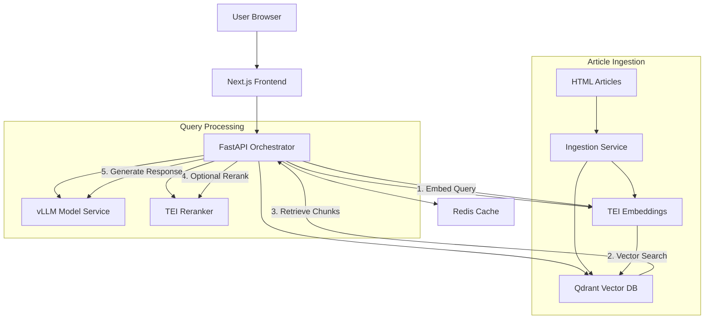

# Ask MaaS - AI-Powered Documentation Assistant

A production-ready Retrieval-Augmented Generation (RAG) system for Red Hat Developer articles, featuring an AI assistant that can answer questions about MaaS (Models-as-a-Service), vLLM, Kuadrant, and OpenShift deployments.

## 🌟 System Overview

Ask MaaS is a comprehensive AI documentation assistant that combines:
- **Interactive Web Interface**: Browse and read technical articles
- **AI-Powered Chat**: Ask questions about any article or topic
- **RAG System**: Vector-based semantic search across all documentation
- **Production Deployment**: Full OpenShift/Kubernetes deployment with GPU acceleration

### Key Features
- 🤖 **Intelligent AI Assistant**: Answers questions with source citations
- 📚 **Global Context Awareness**: AI has knowledge of all indexed articles
- 🚀 **Streaming Responses**: Real-time SSE streaming for better UX
- 🎨 **Beautiful UI**: Modern, responsive interface with styled articles
- 🔍 **Semantic Search**: Pure vector embeddings for accurate retrieval
- ⚡ **GPU Acceleration**: vLLM with optimized inference on NVIDIA GPUs
- 🔄 **One-Click Deployment**: Automated script for complete system setup

## 📚 Adding Articles to the System

### Article Format and Placement

The Ask-MaaS system dynamically loads HTML articles from the filesystem. To add new articles:

1. **Article Location**: Place HTML files in the `ghost-site/public/articles/` directory
2. **File Format**: Articles must be in HTML format with `.html` extension
3. **Naming Convention**: Use descriptive filenames (e.g., `Deploy Llama 3 8B with vLLM _ Red Hat Developer.html`)

### Article Structure

Articles should follow this HTML structure for best compatibility:
```html
<!DOCTYPE html>
<html>
<head>
    <title>Your Article Title</title>
    <meta charset="UTF-8">
</head>
<body>
    <!-- Article content with proper HTML formatting -->
    <h1>Main Title</h1>
    <p>Content paragraphs...</p>
    <!-- Code blocks, lists, images, etc. -->
</body>
</html>
```

### Adding Articles - Step by Step

1. **Prepare your article** in HTML format
2. **Copy to the articles folder**:
   ```bash
   cp your-article.html ghost-site/public/articles/
   ```
3. **Rebuild the frontend** (if running locally):
   ```bash
   cd ghost-site
   npm run build
   ```
4. **For OpenShift deployment**, rebuild and push the image:
   ```bash
   cd ghost-site
   podman build -t ghost-site:latest .
   # Push to your registry
   ```

### Article Indexing

Articles are automatically:
- **Listed** in the frontend UI based on files in the `public/articles` directory
- **Indexed** for vector search when accessed through the chat interface
- **Cached** for performance optimization

### Article Metadata

The system automatically extracts metadata from filenames:
- **Title**: Derived from filename (underscores become spaces)
- **Category**: Determined by keywords (MaaS, AI/ML, Performance, etc.)
- **Date**: Uses current date or can be specified in the HTML meta tags

### Best Practices

1. **Use descriptive filenames** that reflect the article content
2. **Include proper HTML structure** for better rendering
3. **Test locally** before deploying to production
4. **Keep articles focused** on specific topics for better search relevance
5. **Include code examples** in `<pre><code>` blocks for syntax highlighting

## 🏗️ Architecture

### System Components



### Component Details

#### 1. **Frontend (ghost-site)**
- **Technology**: Next.js 14, React, TypeScript
- **Features**:
  - Article browser with categories
  - Full HTML article rendering with styles
  - Integrated AI chat widget
  - Responsive design
- **API Routes**:
  - `/api/articles` - List all articles
  - `/api/articles/[...path]` - Serve article HTML content

#### 2. **Orchestrator API (ask-maas-api)**
- **Technology**: FastAPI, Python 3.11, Uvicorn
- **Endpoints**:
  - `/api/v1/chat` - Process chat queries with RAG
  - `/api/v1/ingest/content` - Ingest new articles
  - `/health/ready` - Readiness probe
  - `/health/live` - Liveness probe
- **Services**:
  - `VectorRetrievalService` - Semantic search implementation
  - `LLMService` - Model interaction and streaming
  - `CacheService` - Redis caching layer

#### 3. **Vector Database (Qdrant)**
- **Purpose**: Store and search document embeddings
- **Features**:
  - Cosine similarity search
  - Metadata filtering
  - Persistent storage
- **Configuration**:
  - Collection: `ask-maas`
  - Vector dimension: 768
  - Distance metric: Cosine

#### 4. **Embedding Service (TEI)**
- **Model**: `BAAI/bge-base-en-v1.5`
- **Purpose**: Convert text to vector embeddings
- **Performance**: ~100ms per embedding

#### 5. **LLM Service (vLLM)**
- **Models Available**:
  - Mistral-7B-Instruct (default)
  - Llama-3-8B
  - Mixtral-8x7B
  - Qwen2.5-32B
- **GPU**: NVIDIA A10G or better
- **Features**:
  - Continuous batching
  - PagedAttention
  - Streaming inference

#### 6. **Reranker Service**
- **Model**: `BAAI/bge-reranker-base`
- **Purpose**: Re-score retrieved chunks for relevance
- **Optional**: Can be disabled for faster responses

#### 7. **Redis Cache**
- **Purpose**: Cache embeddings and frequent queries
- **TTL**: 1 hour for embeddings, 5 minutes for queries

## 📁 Project Structure

```
ask-maas/
├── ask-maas-api/              # Backend API service
│   ├── app/                   # Core application
│   │   ├── routers/          # API endpoints
│   │   │   ├── chat.py       # Chat endpoint with RAG
│   │   │   └── ingest.py     # Document ingestion
│   │   ├── services/         # Business logic
│   │   │   ├── vector_retrieval.py  # Vector search
│   │   │   ├── llm.py        # LLM integration
│   │   │   ├── cache.py      # Redis caching
│   │   │   └── config.py     # Configuration
│   │   └── models/           # Data models
│   ├── Dockerfile            # Container definition
│   └── requirements.txt      # Python dependencies
│
├── ghost-site/               # Frontend application
│   ├── src/
│   │   ├── app/             # Next.js app directory
│   │   │   ├── api/        # API routes
│   │   │   └── page.tsx    # Main page
│   │   └── components/      # React components
│   │       ├── ArticleViewer.tsx
│   │       └── ChatWidget.tsx
│   ├── Dockerfile           # Frontend container
│   └── package.json         # Node dependencies
│
├── k8s/                     # Kubernetes/OpenShift configs
│   ├── api/                # API deployments
│   ├── frontend/           # Frontend deployment
│   ├── models/             # Model services
│   │   ├── vllm-*.yaml    # vLLM deployments
│   │   ├── tei-*.yaml     # TEI services
│   │   └── qdrant.yaml    # Vector database
│   └── namespaces/         # Namespace definitions
│
├── articles/               # Documentation articles
│   ├── All you can kustomize...html
│   ├── Deploy Llama 3 8B...html
│   ├── Ollama vs. vLLM...html
│   ├── Profiling vLLM...html
│   └── What is MaaS...html
│
├── deploy-ask-maas.sh     # One-click deployment script
├── deploy-config.yaml     # Deployment configuration
└── README.md             # This file
```

## 🚀 Quick Start

> **Want to deploy in 5 minutes?** Check out our [Quick Start Guide](QUICKSTART.md) for the fastest path to deployment.

## 📋 Prerequisites

1. **OpenShift/Kubernetes Cluster** with:
   - GPU nodes (for vLLM)
   - Internal registry access
   - Sufficient resources (min 32GB RAM, 4 CPUs)

2. **Local Tools**:
   ```bash
   # Required
   - OpenShift CLI (oc) v4.14+
   - Python 3.9+
   - Podman or Docker
   
   # Python packages (for ingestion)
   pip install beautifulsoup4 requests
   ```

3. **Cluster Access**:
   ```bash
   oc login --token=<your-token> --server=<your-server>
   ```

### One-Command Deployment

Deploy the entire system with a single command:

```bash
# Clone the repository
git clone https://github.com/yourusername/ask-maas.git
cd ask-maas

# Deploy everything (takes ~15-20 minutes)
./deploy-ask-maas.sh

# For clean redeployment
./deploy-ask-maas.sh --cleanup
```

The script will:
1. Create namespaces (`ask-maas-models`, `ask-maas-api`)
2. Deploy Qdrant vector database
3. Deploy Redis cache
4. Deploy TEI embedding service
5. Deploy vLLM model service (Mistral-7B)
6. Build and deploy the orchestrator API
7. Build and deploy the frontend
8. Ingest all articles into RAG
9. Configure routes and verify deployment

### Manual Deployment Steps

If you prefer manual deployment:

```bash
# 1. Create namespaces
oc apply -f k8s/namespaces/

# 2. Deploy infrastructure services
oc apply -f k8s/models/qdrant.yaml
oc apply -f k8s/api/redis-deployment.yaml

# 3. Deploy ML services
oc apply -f k8s/models/tei-embeddings.yaml
oc apply -f k8s/models/vllm-mistral-7b.yaml

# 4. Build and deploy API
cd ask-maas-api
podman build -t ask-maas-api:latest .
podman tag ask-maas-api:latest $(oc registry info)/ask-maas-api/ask-maas-api:latest
podman push $(oc registry info)/ask-maas-api/ask-maas-api:latest
oc apply -f ../k8s/api/orchestrator-deployment.yaml

# 5. Build and deploy frontend
cd ../ghost-site
podman build -t ghost-site:latest .
podman tag ghost-site:latest $(oc registry info)/ask-maas-api/ghost-site:latest
podman push $(oc registry info)/ask-maas-api/ghost-site:latest
oc apply -f ../k8s/frontend/ghost-site-deployment.yaml

# 6. Ingest articles
python3 ../ask-maas-api/ingest_articles.py
```

### Configuration

The deployment can be customized via `deploy-config.yaml`:

```yaml
# Model configuration
model:
  name: "mistralai/Mistral-7B-Instruct-v0.3"
  replicas: 1
  gpu_count: 1
  memory_limit: "24Gi"

# API configuration
orchestrator:
  replicas: 2
  cpu_request: "500m"
  memory_request: "1Gi"

# Frontend configuration
frontend:
  replicas: 2
  cpu_request: "100m"
  memory_request: "256Mi"
```

## 🔧 How It Works

### RAG Pipeline

1. **Query Processing**
   ```
   User Query → Embedding Generation → Vector Search → Chunk Retrieval
   ```

2. **Context Retrieval**
   - Query is converted to 768-dimensional vector
   - Cosine similarity search across all document chunks
   - Top-K most relevant chunks retrieved
   - Optional reranking for better precision

3. **Response Generation**
   - Retrieved chunks provided as context to LLM
   - Model generates response with citations
   - Response streamed to user in real-time

### Article Ingestion Process

1. **HTML Parsing**
   ```python
   HTML Article → BeautifulSoup → Text Extraction → Chunking
   ```

2. **Vectorization**
   ```python
   Text Chunks → TEI Embeddings → 768-dim Vectors → Qdrant Storage
   ```

3. **Metadata Storage**
   - Article title and URL
   - Chunk position and content
   - Creation timestamp

## 📊 API Reference

### Chat Endpoint

**POST** `/api/v1/chat`

```json
{
  "query": "How to customize rate limit policy in MaaS?",
  "page_url": "current-article-url",
  "stream": true
}
```

**Response** (SSE Stream):
```json
{"type": "text", "content": "To customize rate limit policy..."}
{"type": "citation", "source": "All you can kustomize...", "relevance": 0.92}
{"type": "done"}
```

### Ingest Endpoint

**POST** `/api/v1/ingest/content`

```json
{
  "page_url": "https://example.com/article",
  "title": "Article Title",
  "content": "Article content...",
  "content_type": "text",
  "force_refresh": true
}
```

### Health Endpoints

**GET** `/health/ready` - Readiness check
**GET** `/health/live` - Liveness check

## 🧪 Testing

### Test Deployment

```bash
# Run automated tests
./test-deployment.sh

# Manual testing
curl -X POST https://ask-maas-api.apps.your-cluster/api/v1/chat \
  -H "Content-Type: application/json" \
  -d '{"query": "What is MaaS?", "stream": false}'
```

### Sample Queries

The system can answer questions like:
- ✅ "How to customize rate limit policy in MaaS?"
- ✅ "What are the benefits of MaaS?"
- ✅ "How does kustomize work with MaaS?"
- ✅ "How to deploy Llama 3 with vLLM?"
- ✅ "What GPU profiling tools work with vLLM?"
- ✅ "Compare Ollama vs vLLM performance"

## 🐛 Troubleshooting

### Common Issues

1. **Pods not starting**
   ```bash
   # Check pod status
   oc get pods -n ask-maas-api
   oc describe pod <pod-name> -n ask-maas-api
   ```

2. **Model service timeout**
   ```bash
   # Increase timeout in deployment
   oc set env deployment/ask-maas-orchestrator -n ask-maas-api \
     REQUEST_TIMEOUT=120
   ```

3. **CORS errors**
   ```bash
   # Update CORS origins
   oc set env deployment/ask-maas-orchestrator -n ask-maas-api \
     CORS_ORIGINS='["*"]'
   ```

4. **Articles not loading**
   ```bash
   # Re-ingest articles
   ./deploy-ask-maas.sh --ingest-only
   ```

### Logs

```bash
# API logs
oc logs -f deployment/ask-maas-orchestrator -n ask-maas-api

# Frontend logs
oc logs -f deployment/ghost-site -n ask-maas-api

# Model service logs
oc logs -f deployment/vllm-mistral-7b -n ask-maas-models
```

## 🔐 Security

- **Network Policies**: Restricted inter-namespace communication
- **RBAC**: Service accounts with minimal permissions
- **Secrets Management**: Sensitive data in OpenShift secrets
- **CORS**: Configurable allowed origins
- **Rate Limiting**: Optional Kuadrant integration

## 📈 Performance

### Metrics

- **Query Latency**: ~2-5 seconds (with GPU)
- **Ingestion Speed**: ~10 articles/minute
- **Concurrent Users**: 100+ (with 2 API replicas)
- **Vector Search**: <100ms for 100K chunks
- **Model Inference**: ~30 tokens/second

### Optimization Tips

1. **Increase API replicas** for more concurrent users
2. **Add GPU nodes** for faster model inference
3. **Enable Redis caching** for frequent queries
4. **Use smaller models** (Mistral-7B) for speed
5. **Adjust chunk size** (default: 800 chars)

## 🛠️ Development

### Local Setup

```bash
# Backend
cd ask-maas-api
python -m venv venv
source venv/bin/activate
pip install -r requirements.txt
uvicorn app.main:app --reload

# Frontend
cd ghost-site
npm install
npm run dev
```

### Environment Variables

Create `.env` file:
```env
# Model Services
VLLM_URL=http://localhost:8080
TEI_EMBEDDINGS_URL=http://localhost:8081
QDRANT_URL=http://localhost:6333

# Redis
REDIS_HOST=localhost
REDIS_PORT=6379

# CORS
CORS_ORIGINS=["http://localhost:3000"]
```

## 🚦 Monitoring

### Prometheus Metrics

Available at `/metrics` endpoint:
- Request count and latency
- Token generation rate
- Cache hit/miss ratio
- Vector search performance

### Grafana Dashboards

Import provided dashboards from `k8s/observability/`:
- System Overview
- RAG Performance
- Model Inference Metrics

## 🤝 Contributing

1. Fork the repository
2. Create feature branch (`git checkout -b feature/enhancement`)
3. Commit changes (`git commit -am 'Add feature'`)
4. Push branch (`git push origin feature/enhancement`)
5. Open Pull Request

## 📝 License

Apache License 2.0 - See LICENSE file

## 🆘 Support

- **Issues**: Open GitHub issue
- **Documentation**: Check `/docs` folder
- **Community**: Join our Discord server

## 🎯 Roadmap

- [ ] Multi-model support (Claude, GPT-4)
- [ ] Document upload interface
- [ ] User authentication
- [ ] Analytics dashboard
- [ ] Mobile app
- [ ] API rate limiting
- [ ] Batch processing
- [ ] Export conversation history

---

*Built with ❤️ for AI-powered documentation*